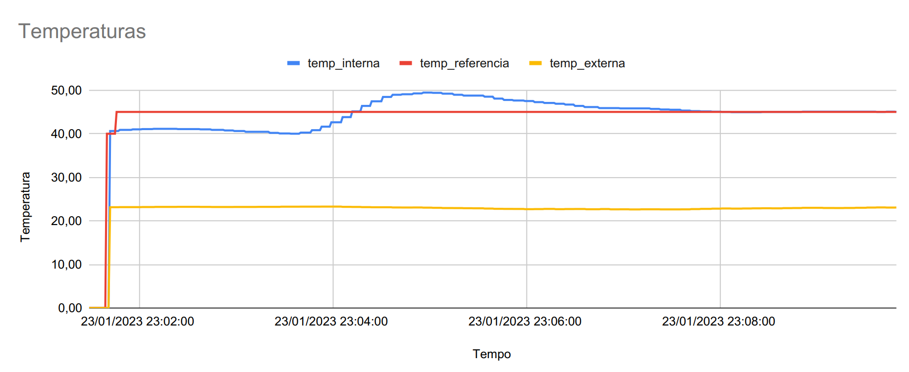
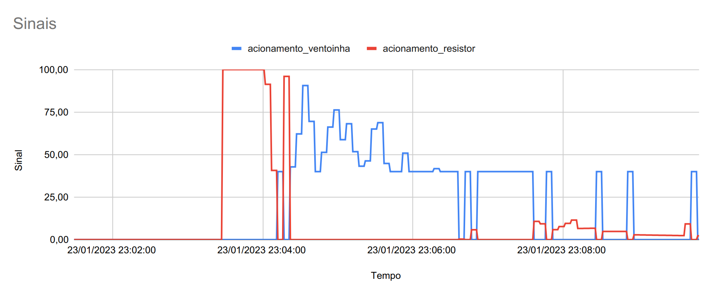

# Trabalho 2 - Forno PCB

|Nome|Matricula|
|:-:|:-:|
|Guilherme Rogelin Vial|190014032|

## Dependências

```sh
pip install simple_pid
pip install pyserial
pip install adafruit-circuitpython-bme280
pip install RPi.GPIO
```

## Para Rodar

```sh
# Navega até a pasta
$ cd src
# Executa o programa
$ python3 main.py
```

## Experimento - Temperatura fixa




## Vídeo

[]()
